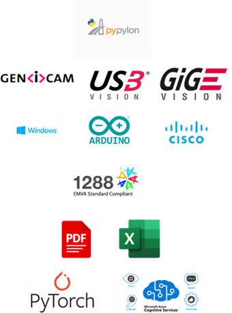
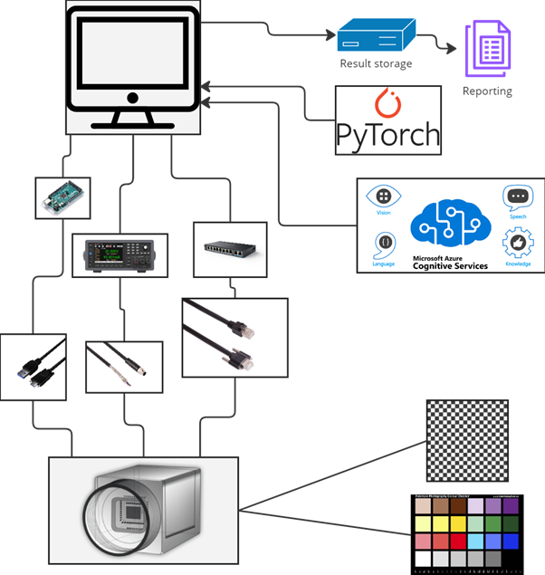

---

# GenICamTester

Generic industrial camera (GenICAM) tester based on Pypylon.

---

## Feature
GUI: User-friendly interface for easy interaction.
Camera Control: Functions for starting, stopping, and initializing cameras.
GenICam API Utilities: XML parsing and feature access.
Image Processing: OpenCV functions for image manipulation.
AI Integration: Analyze live or captured images using AI.
Power Tests: Power ON and cycle tests.
Image Acquisition Tests: Evaluate image acquisition and FPS.
Feature Access Tests: Dynamic discovery and access of GenICam features.
Trigger and Sync Tests: Trigger, strobe, and synchronization tests.
Multi-Camera Tests: Synchronization of multiple cameras.
ROI Tests: User-defined ROI and event handling.
Image Quality Tests: Assess sharpness, color accuracy, noise, and edge detection.
Comprehensive Logging: Detailed logs for test runs and errors.
Test Reports: Generate test coverage reports.
## Build Instructions

  

    
    
<b>Packages Utilized</b>

  

  

    
    
<b>System Diagram</b>

  

---

## File Structure

### Configuration Files
- **config/**  
  - `config.ini` — General configurations for tests.  
  - `camera_settings.json` — Camera-specific settings (e.g., resolutions, modes).  

### Test Resources
- **data/**  
  - `test_images/` — Images used for image quality tests.  
  - `calibration_files/` — Calibration files for camera testing.  

### Documentation
- **docs/**  
  - `architecture.md` — High-level architecture description of the tester.  
  - `test_plan.md` — Detailed test plans for the modules.  
  - `test_report_template.md` — Template for test reports.  

### Logs
- **logs/**  
  - `test.log` — Main log file for test runs.  
  - `error.log` — Log for errors and exceptions.  

### Reports
- **reports/**  
  - `coverage/` — Test coverage reports (HTML).  

### Source Code
- **src/**  
  - **GUI**  
    - `main_gui.py` — Main GUI script.  
  - **Libraries**  
    - `camera_helper.py` — Functions for camera control (start/stop, init).  
    - `genicam_helper.py` — Utilities for working with GenICam API (XML parsing, feature access).  
    - `image_helper.py` — Functions for image processing (OpenCV functions).  
    - `utils.py` — General utility functions (logging, error handling).  
    - `ai_service.py` — Functions for AI-based image analysis.  
  - **Tests**  
    - `test_power.py` — Power ON and cycle tests.  
    - `test_image_acquisition.py` — Image acquisition, FPS tests.  
    - `test_feature_access.py` — Test for GenICam feature access (dynamic discovery).  
    - `test_trigger_strobe.py` — Trigger, strobe, sync tests.  
    - `test_multicam.py` — Multi-camera synchronization tests.  
    - `test_roi.py` — User-defined ROI and event handling tests.  
    - `test_image_quality.py` — Sharpness, color accuracy, noise, edge detection.  
    - `test_ai_service.py` — Tests for AI-based image analysis.  
  - `__main__.py` — Entry point script (CLI for running tests, optional).  

### Additional Files
- `.env` — Environment variables (optional, for sensitive info).  
- `.gitignore` — Gitignore file for ignoring unnecessary files.  
- `pytest.ini` — Pytest configuration (reporting, test paths).  
- `requirements.txt` — List of dependencies (pypylon, pytest, pytest-cov, etc.).  
- `README.md` — Overview and setup guide for the project.  

Hardware
1. Test chart
2. Lens
3. Light source
